# SimpleSync Server

!!!Disclaimer: I made the app with the help of AI.

Self-hosted file sync server for the [SimpleSync Companion](https://github.com/xluciangit/SimpleSync-Companion) Android app. Node.js + SQLite, runs in Docker.

---

## Screenshots

### Desktop

| Dark | Light |
|------|-------|
| 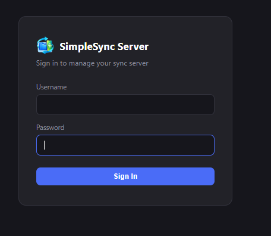 | 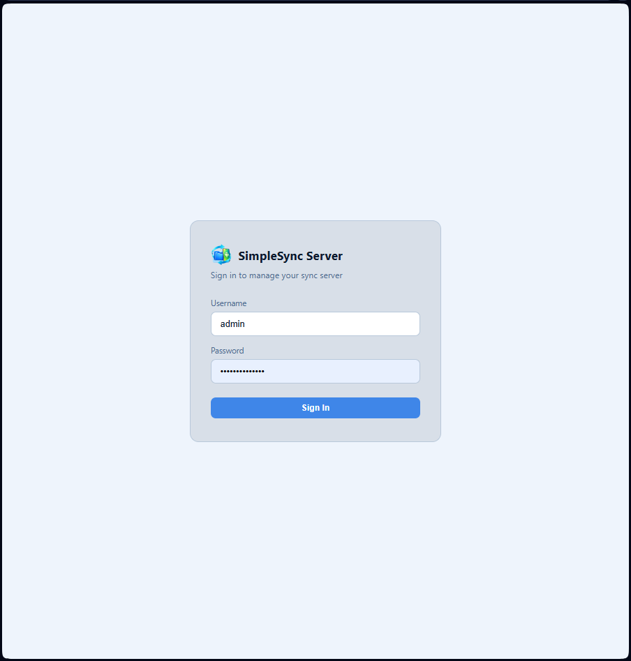 |
| 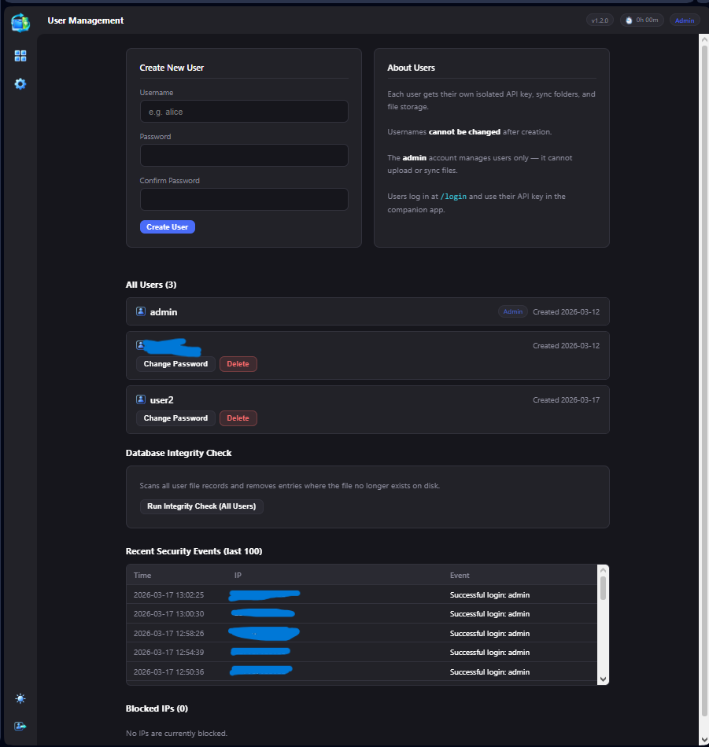 | 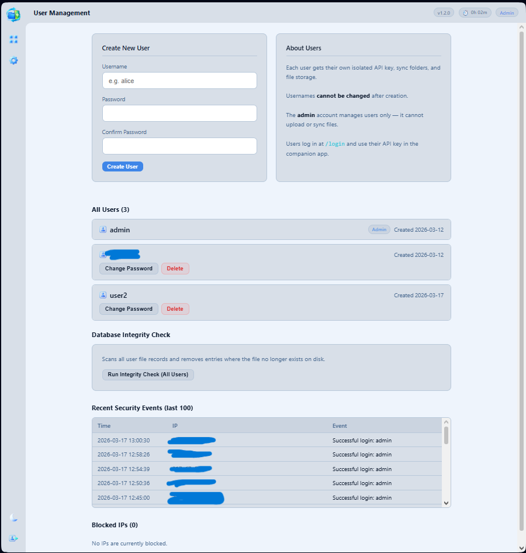 |
| 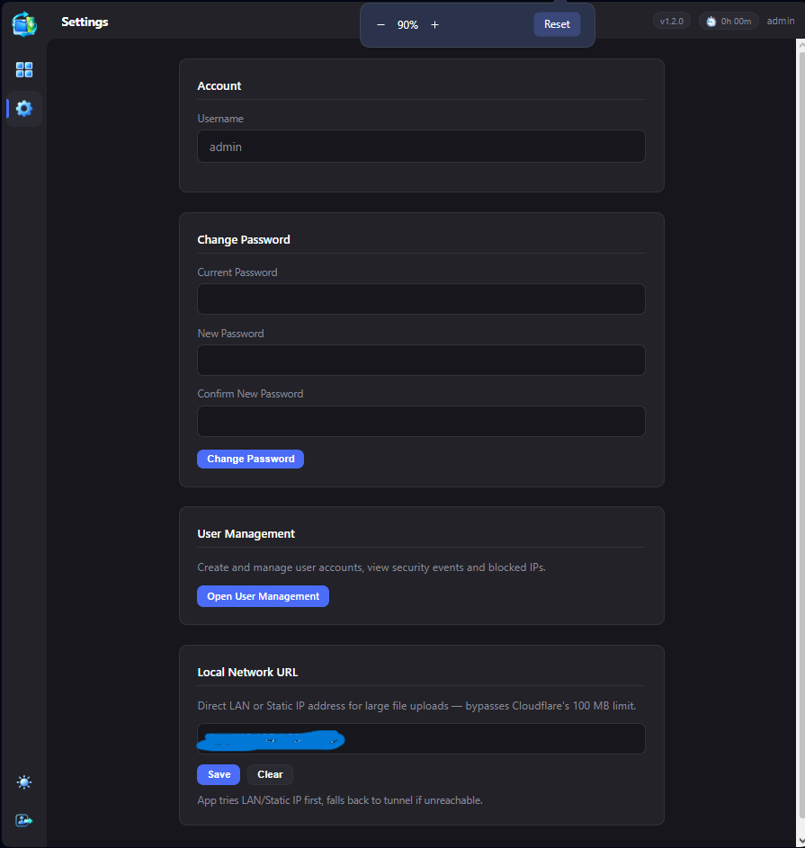 | 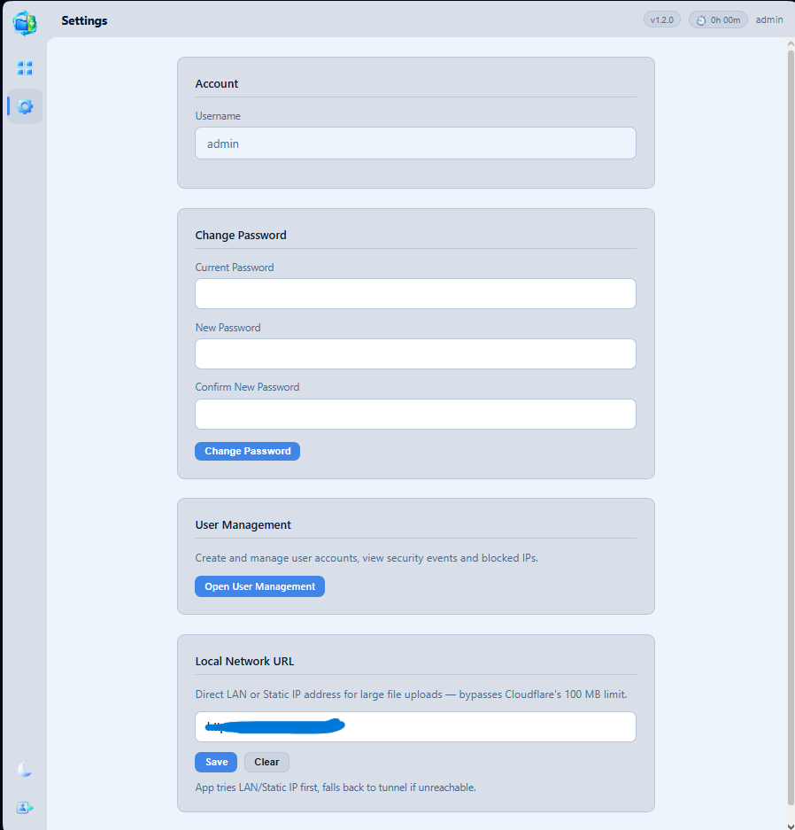 |
| 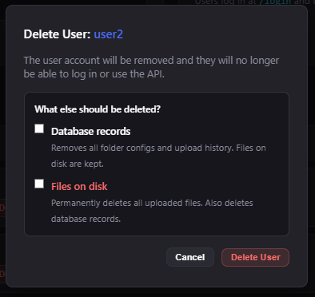 | 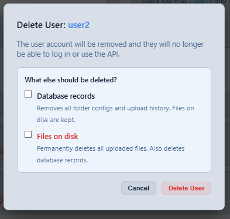 |
| 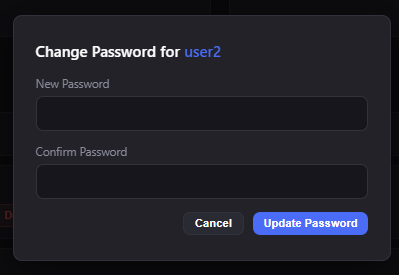 | 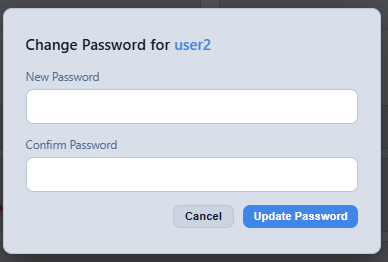 |
| 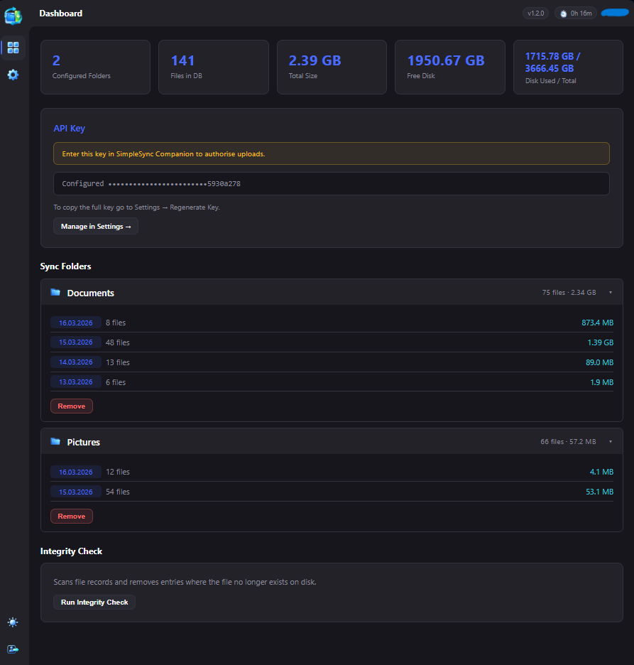 | 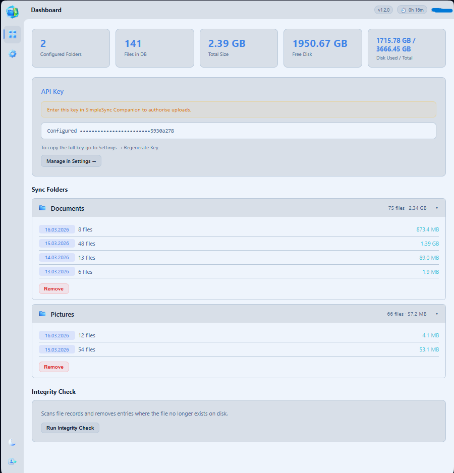 |
| 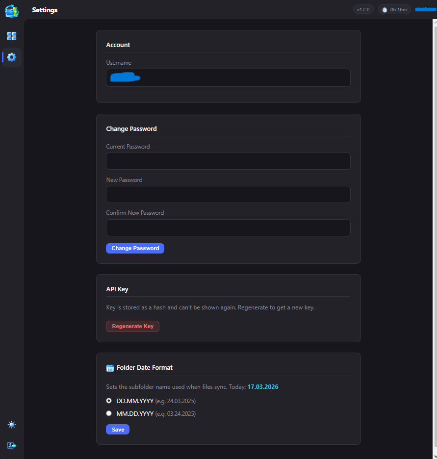 | 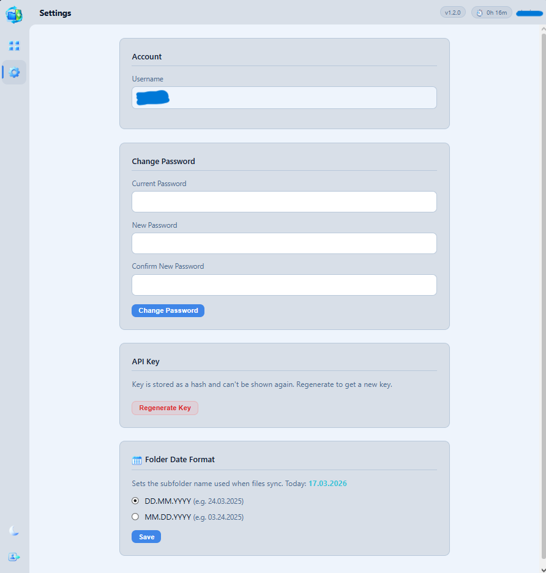 |
| 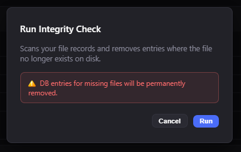 | 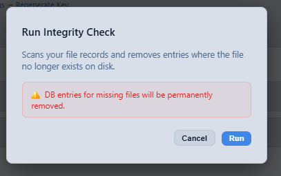 |
| 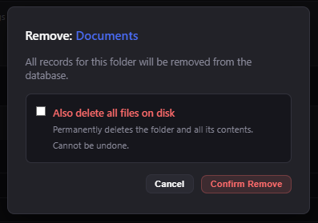 | 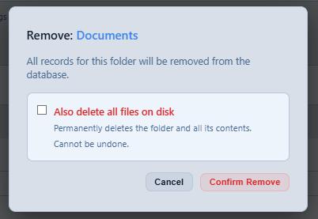 |
| 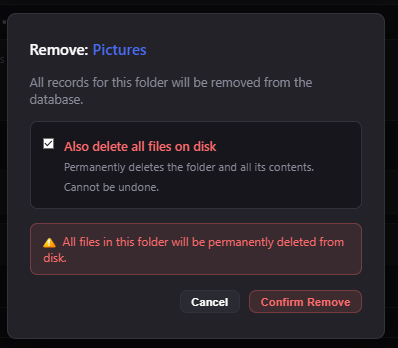 | 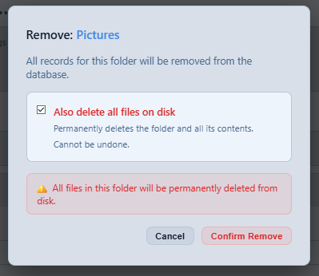 |

---

## Features

- Dashboard with folder file counts, sizes per date, and disk usage
- Multi-user — each user has their own file space, API key, and settings
- SHA-256 deduplication — files already on the server are skipped
- Files stored at `/data/{username}/{folder}/{date}/`
- Date format is per-user (DD.MM.YYYY or MM.DD.YYYY) and can be changed at any time
- Dark / light theme
- Integrity check for users and admin
- Login rate limiting, account lockout, permanent IP block for repeat offenders
- Security events log
- Cloudflare Tunnel compatible

---

## Quick Start

```bash
docker run -d \
  --name simplesync-server \
  -p 3000:3000 \
  -v /your/path/data:/data \
  -v /your/path/config:/config \
  --restart unless-stopped \
  xlucian1007/simplesync-server:1.2.1
```

Or with Compose:

```yaml
services:
  simplesync-server:
    image: xlucian1007/simplesync-server:1.2.1
    container_name: simplesync-server
    ports:
      - "3000:3000"
    volumes:
      - /your/path/data:/data
      - /your/path/config:/config
    restart: unless-stopped
```

```bash
docker compose up -d
```

Open `http://localhost:3000`. First-run admin credentials are in the container logs:

```bash
docker logs simplesync-server
```

---

## Environment Variables

| Variable     | Default   | Description |
|--------------|-----------|-------------|
| `PORT`       | `3000`    | Internal port |
| `DATA_DIR`   | `/data`   | Where uploaded files go |
| `CONFIG_DIR` | `/config` | Where the SQLite DB is stored |

---

## Volumes

| Path      | What goes there |
|-----------|-----------------|
| `/data`   | Uploaded files |
| `/config` | `sss.db` — keep this persistent or you lose everything |

---

## Web UI

**Admin** logs in and lands on User Management. From there: create/delete accounts, force password resets, view the security log, unblock IPs, run integrity check across all users, and set the Direct Upload URL for large files.

**Users** get a dashboard with their sync folders, file counts per date, and disk stats. Settings covers password, API key, and date format. The API key is only shown once after you regenerate it — copy it somewhere safe or straight into the Android app.

---

## API

All endpoints need `x-api-key: <key>` in the header. Admin account can't use the API.

| Method | Endpoint | What it does |
|--------|----------|--------------|
| `GET` | `/api/ping` | Health check, no auth needed |
| `GET` | `/health` | Server health and uptime |
| `GET` | `/api/config` | Returns the Direct Upload URL |
| `POST` | `/api/check-hash` | `{ hash, folder }` → `{ exists }` |
| `POST` | `/api/upload` | Multipart: `file`, `folder`, `relative_path`, `hash` |
| `GET` | `/api/folders` | List folders with stats |
| `POST` | `/api/folders` | Create a folder: `{ name }` |
| `GET` | `/api/folders/validate` | `?name=x` → `{ inDb, onDisk }` |
| `GET` | `/api/stats` | File count and total size |
| `GET` | `/api/integrity-status` | `{ flag }` — 1 if integrity check removed records |
| `POST` | `/api/integrity-acknowledge` | Resets the integrity flag |

---

## File Layout

```
/data/
  alice/
    Documents/
      11.03.2025/
        report.pdf
      12.03.2025/
        invoice.pdf
    Photos/
      11.03.2025/
        IMG_001.jpg
  bob/
    Backup/
      11.03.2025/
        ...
```

---

## Build from Source

The server is split across a few files:

```
server.js
lib/
  db.js
  security.js
routes/
  auth.js
  api.js
  users.js
  settings.js
views/
  templates.js
static/
```

```bash
git clone https://github.com/xluciangit/SimpleSyncServer.git
cd SimpleSyncServer
docker build -t simplesync-server .
docker run -d -p 3000:3000 \
  -v $(pwd)/data:/data \
  -v $(pwd)/config:/config \
  simplesync-server
```

---

## Cloudflare Tunnel

Point `cloudflared` at `http://localhost:3000`. Then in Admin → Settings set the Direct Upload URL to your local/static address, e.g. `http://192.168.1.100:3000`. The Android app handles the routing — tunnel for normal files, direct for anything over 100 MB when you're on the same network.

---

## Security

- Passwords hashed with bcrypt
- API keys stored as SHA-256 hashes
- 10 failed logins locks the account for 30 minutes
- 200 login attempts per 5 minutes globally caps botnet attacks
- 3 rate limit violations = permanent IP block
- Everything logged to the security events table
- Path traversal guarded on all file operations
- HTML output escaped on all user-controlled values
- Admin and user roles are fully separated

---

## License

MIT

[](https://ko-fi.com/xlucian)